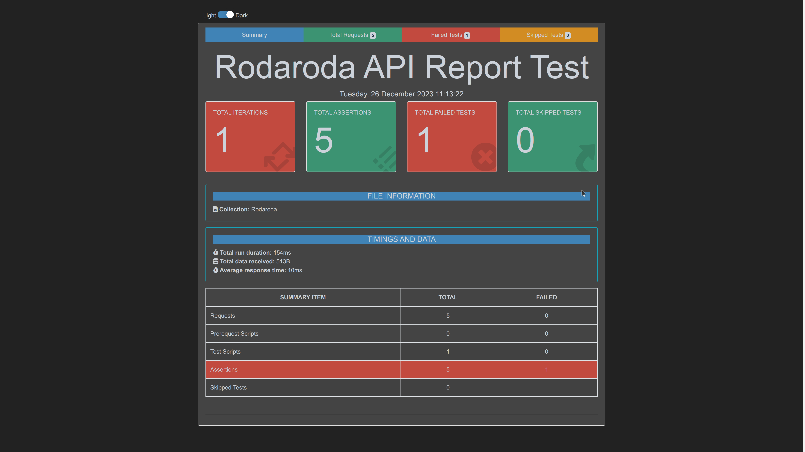

# RODARODA - SIMPLY A CRUD POC

App environment:


App architecture (just a scratch :) ):


Data base diagram:


## TABLE OF CONTENTS

[OVERVIEW](#overview)

[PREREQUISITES](#prerequisites)

[USE CASES](#use-cases)

[API](#api)

[TESTING](#testing)

[LICENSE](#license)

[REFERENCES](#references)

## OVERVIEW

The objective of this README.md document file is to provide help on how to run the automated deployment of a CRUD project, as a Proof of Concept (POC), running a backend service that supports CRUD operations.

The purpose of this app is to build a basic structure for a backend application, along with an automated database, where, upon sending requests to the backend, we can query and insert data into it.

The master carrier's structure revolves around trips, with dependencies on entities such as location (origin and destination types), product, and carrier.

Below is the code for the creation of the tables as automated in the Ansible Playbooks:

```
-- Criação da tabela Localidade
CREATE TABLE Localidade (
    localidade_id SERIAL PRIMARY KEY,
    nome VARCHAR(100) NOT NULL,
    tipo VARCHAR(10) CHECK (tipo IN ('origem', 'destino'))
);

-- Criação da tabela Produto
CREATE TABLE Produto (
    produto_id SERIAL PRIMARY KEY,
    nome VARCHAR(100) NOT NULL,
    descricao TEXT
);

-- Criação da tabela Transportadora
CREATE TABLE Transportadora (
    transportadora_id SERIAL PRIMARY KEY,
    nome VARCHAR(100) NOT NULL,
    contato VARCHAR(50)
);

-- Criação da tabela Veículo
CREATE TABLE Veiculo (
    veiculo_id SERIAL PRIMARY KEY,
    modelo VARCHAR(100) NOT NULL,
    placa VARCHAR(20)
);

-- Criação da tabela Viagem
CREATE TABLE Viagem (
    viagem_id SERIAL PRIMARY KEY,
    origem_id INT REFERENCES Localidade(localidade_id) ON DELETE NO ACTION,
    destino_id INT REFERENCES Localidade(localidade_id) ON DELETE NO ACTION,
    produto_id INT REFERENCES Produto(produto_id),
    transportadora_id INT REFERENCES Transportadora(transportadora_id),
    veiculo_id INT REFERENCES Veiculo(veiculo_id),
    data_partida TIMESTAMP,
    data_chegada TIMESTAMP
);
```

## PREREQUISITES

1. docker: 24.0;

2. docker compose: 2.17;

3. a postgres dbms server and populate the database project structure, running the ansible playbook rodaroda.yml,

`ansible-playbook -vv -e "ansible_user=ansible" -K rodaroda.yml`

from the project: https://github.com/rubenschagas/ansibleAutomatedPlaybooks

Note: Ansible playbooks are used in automating infrastructure setup.

4. a postgres dbms client, like DBeaver: >=23.x (optional);

5. npm: ^8.11.0;

6. node: ^16.16.0.

On the rodaroda project folder, open a terminal and run the following command:

```
npm install
```

Additionally, install the following dependencies:

```
npm install -g newman newman-reporter-htmlextra
```

## USE CASES

Start the server:

Make sure the Node.js server is running. 

You can start the server by executing the following command in the terminal within the project directory:

```
node index.js
```

## API

It is possible to send requests through Postman to test the CRUD endpoints created in the previous example. 

The default port is `3000`.

Here are some steps to test the GET and POST endpoints for the `localidade` entity:

Open the Postman application.

Import the collection file available at assets/collections folder.

Open the `Consulta de Produtos` request.

---

Send a GET request to list localities:

Select the GET method.

Enter the URL: http://localhost:3000/localidades

Click "Send" to submit the request.

---

Send a POST request to create a locality:

Select the POST method.

Enter the URL: http://localhost:3000/localidades

Go to the "Body" tab and select the raw format.

Insert the locality data in the request body, json, for example:

```
{
"nome": "Localidade Teste",
"tipo": "origem"
}
```

Click "Send" to submit the request.

---

## TESTING

The tests cover the project endpoints, and users can interpret the results through a report. 

For a description of what the Postman collection covers or what kind of scenarios it tests please open the collection file itself to see them, or see the visual evidence below.

Run the collection tests:

```
newman run assets/collections/rodaroda-postman-collection.json -r htmlextra --reporter-htmlextra-browserTitle "Rodaroda API Report Test" --reporter-htmlextra-title "Rodaroda API Report Test"
```

A folder named `Newman`will be created with a html report file as follows:


## LICENSE

This project is release with a public license.

## REFERENCES

#### [Official Docker Daemon Documentation Install](https://docs.docker.com/engine/install/ubuntu/)

#### [Official Docker Compose Documentation Install](https://docs.docker.com/compose/install/linux/#install-the-plugin-manually)

#### [Official Ansible Documentation Install](https://docs.ansible.com/ansible/2.9/installation_guide/intro_installation.html#installing-ansible-on-ubuntu)
