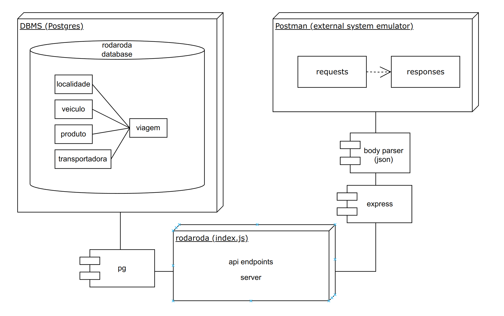
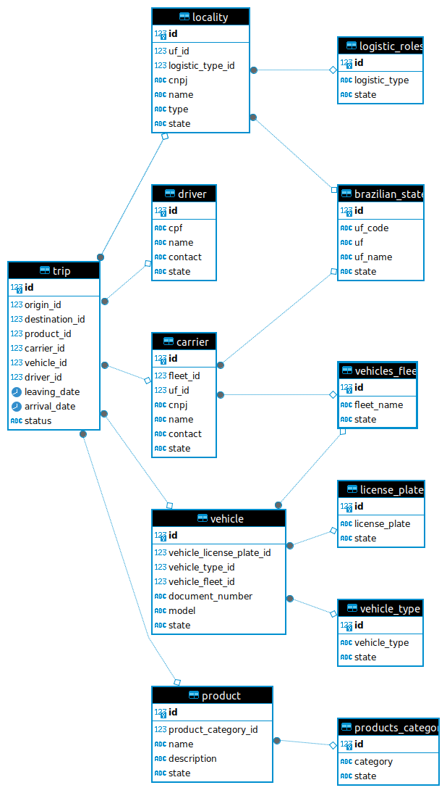
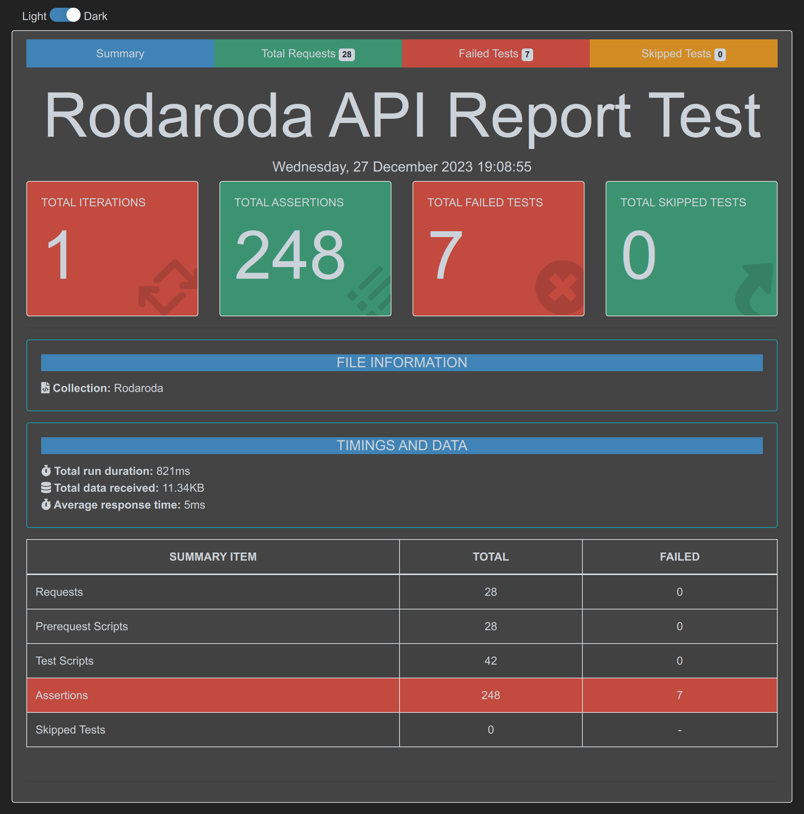
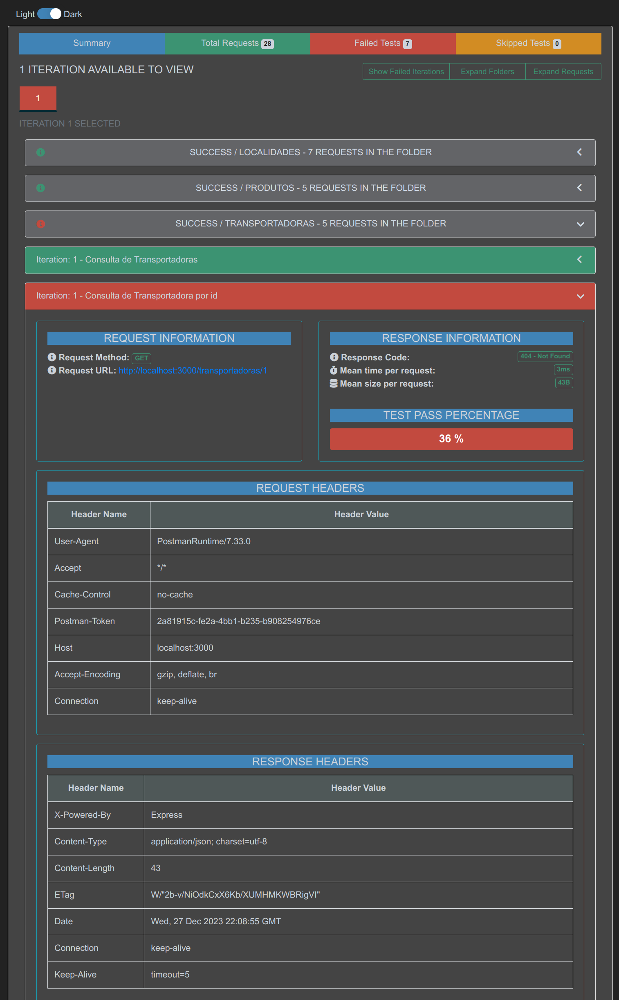
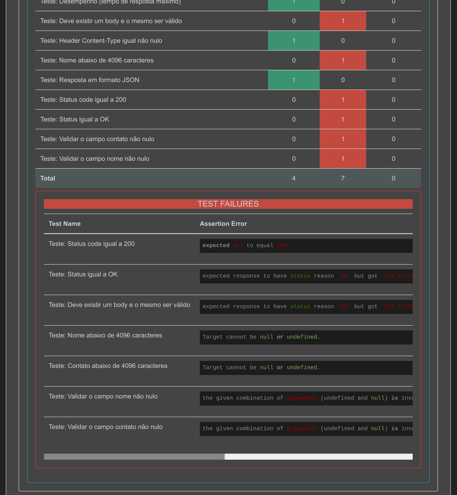

# RODARODA LOG - SIMPLY A CRUD HACKATHON: CRAFTING DEVOPS SOLUTIONS

## TABLE OF CONTENTS

[OVERVIEW](#overview)

[ARCHITECTURE](#architecture)

[PREREQUISITES](#prerequisites)

[USE CASES](#use-cases)

[API](#api)

[TESTING](#testing)

[LICENSE](#license)

[REFERENCES](#references)

[TOOLS](#tools)

## OVERVIEW

This README.md document aims to guide you through the automated deployment of a DevOps project, specifically 
a hackathon featuring a backend service supporting CRUD operations.

The purpose of this app is to build a basic structure for a backend application, along with an automated database. 
Upon sending requests to the backend, we can query and insert data into it.

The master carrier's structure revolves around trips, with dependencies on entities such as location (origin and 
destination types), product, driver, vehicle and carrier.

Additionally, it will execute Postman collection tests against the backend and generate a visually appealing 
HTML report for the test run.

Furthermore, there are specific objectives to achieve, including the implementation of standards, design patterns, 
code formatters, JDoc, building an authentication process, frontend development, introducing new entities, CI-CD, 
cloud, observability, and enhancements to application and business rules, among others.

Thus, the overall goal is to develop skills in the domains of DevOps, Development, QA, and SRE.

## ARCHITECTURE

### App environment


### App architecture


### Database diagram


### Database structure
Below is the code for the creation of the tables as automated in the Ansible Playbooks:

```
-- Creating the Brazil states table
CREATE TABLE brazilian_states (
    id SERIAL PRIMARY KEY,
    uf_code varchar(100) NOT NULL UNIQUE,
    uf varchar(100) NOT NULL UNIQUE,
    uf_name varchar(100) NOT NULL UNIQUE,
    state VARCHAR(10) CHECK (state IN ('active', 'inactive'))
);

-- Creating the Logistic roles table
CREATE TABLE logistic_roles (
    id SERIAL PRIMARY KEY,
    logistic_type varchar(100) CHECK (logistic_type IN ('distribution', 'production', 'reversed', 'supply')) NOT NULL UNIQUE,
    state VARCHAR(10) CHECK (state IN ('active', 'inactive'))
);

-- Creating the Locality table
CREATE TABLE locality (
    id SERIAL PRIMARY KEY,
    uf_id int REFERENCES brazilian_states(id) ON DELETE NO ACTION,
    logistic_type_id int REFERENCES logistic_roles(id) ON DELETE NO ACTION,
    cnpj VARCHAR(100) NOT NULL,
    name VARCHAR(100) NOT NULL,
    type VARCHAR(10) CHECK (type IN ('origin', 'destination')) NOT NULL,
    state VARCHAR(10) CHECK (state IN ('active', 'inactive')) NOT NULL
);

-- Creating the Product category table
CREATE TABLE products_category (
    id SERIAL PRIMARY KEY,
    category VARCHAR(100) NOT NULL,
    state VARCHAR(10) CHECK (state IN ('active', 'inactive')) NOT NULL
);

-- Creating the Product table
CREATE TABLE product (
    id SERIAL PRIMARY KEY,
    product_category_id int REFERENCES products_category(id) ON DELETE NO ACTION,
    nome VARCHAR(100) NOT NULL,
    description VARCHAR(100) NOT NULL,
    state VARCHAR(10) CHECK (state IN ('active', 'inactive')) NOT NULL
);

-- Creating the License plate table
CREATE TABLE license_plate (
    id SERIAL PRIMARY KEY,
    license_plate VARCHAR(100) NOT NULL,
    state VARCHAR(10) CHECK (state IN ('active', 'inactive')) NOT NULL
);

-- Creating the Vehicle type table
CREATE TABLE vehicle_type (
    id SERIAL PRIMARY KEY,
    vehicle_type VARCHAR(10) CHECK (vehicle_type IN ('bitrem', 'bau', 'van', 'carreta, 'outros')) NOT NULL UNIQUE,
    state VARCHAR(10) CHECK (state IN ('active', 'inactive')) NOT NULL
);

-- Creating the Vehicle fleet table
CREATE TABLE vehicles_fleet (
    id SERIAL PRIMARY KEY,
    fleet_name NOT NULL UNIQUE,
    state VARCHAR(10) CHECK (state IN ('active', 'inactive')) NOT NULL
);

-- Creating the Vehicles table
CREATE TABLE vehicle (
    id SERIAL PRIMARY KEY,
    vehicle_license_plate_id int REFERENCES license_plate(id) ON DELETE NO ACTION,
    vehicle_type_id int REFERENCES vehicle_type(id) ON DELETE NO ACTION
    vehicle_fleet_id int REFERENCES vehicles_fleet(id) ON DELETE NO ACTION
    document_number VARCHAR(100) NOT NULL UNIQUE,
    model VARCHAR(100) NOT NULL,
    state VARCHAR(10) CHECK (state IN ('active', 'inactive')) NOT NULL
);

-- Creating the Carrier table
CREATE TABLE carrier (
    id SERIAL PRIMARY KEY,
    fleet_id int REFERENCES vehicles_Fleet(id) ON DELETE NO ACTION,
    uf_id int REFERENCES brazilian_states(id) ON DELETE NO ACTION,
    cnpj VARCHAR(100) NOT NULL UNIQUE,
    nome VARCHAR(100) NOT NULL,
    contact VARCHAR(100) not null,
    state VARCHAR(10) CHECK (state IN ('active', 'inactive')) NOT NULL
);

-- Creating the Driver table
CREATE TABLE driver (
    id SERIAL PRIMARY KEY,
    cpf VARCHAR(100) NOT NULL UNIQUE,
    nome VARCHAR(100) NOT NULL,
    contact VARCHAR(100) not null,
    state VARCHAR(10) CHECK (state IN ('active', 'inactive')) NOT NULL
);

-- Creating the Trip table
CREATE TABLE trip (
    id SERIAL PRIMARY KEY,
    origin_id INT REFERENCES locality(id) ON DELETE NO ACTION,
    destination_id INT REFERENCES locality(id) ON DELETE NO ACTION,
    product_id INT REFERENCES product(id),
    carrier_id INT REFERENCES carrier(id),
    vehicle_id INT REFERENCES vehicle(id),
    driver_id INT REFERENCES driver(id),
    leaving_date TIMESTAMP NOT NULL,
    arrival_date TIMESTAMP NOT NULL,
    status VARCHAR(10) CHECK (state IN ('planned', 'released', 'in execution', 'finished', 'canceled')) NOT NULL
);
```

## PREREQUISITES

1. docker: 24.0;

2. docker compose: 2.17;

3. a postgres dbms server and populate the database project structure, running the ansible playbook rodaroda.yml,

`ansible-playbook -vv -e "ansible_user=ansible" -K rodaroda.yml`

from the project: https://github.com/rubenschagas/ansibleAutomatedPlaybooks

Note: Ansible playbooks automate the infrastructure setup of the rodaroda application. This includes creating the DBMS running in a Docker container, creating the database, and finally, creating the tables.

4. a postgres dbms client, like DBeaver: >=23.x (optional);

5. npm: ^8.11;

6. node: ^16.16;

7. ts-node: ^10.9.

On the rodaroda project folder, open a terminal and run the following command:

```
npm install
```

Additionally, install the following dependencies:

```
npm install -g newman newman-reporter-htmlextra
```

Newman will execute the Postman collection against the backend, and the newman-reporter-htmlextra will generate a beautiful HTML report for the test run.

## USE CASES

Start the server:

It has a [Command Line Interface](https://github.com/yargs/yargs) e helping a user or a pipeline cloud to inform specific runtime parameters.

You can start the server by executing the following command in the terminal within the project directory:

```
ts-node rodaroda.ts
```

Make sure the Node.js server is running.

This project supports some customized parameters, such as: both tenant and environment of the <i>YMS</i>; user and password credentials; video generation for the scenarios; and so on.

A useful menu help with all possible parameters can be viewed with following command:

```
> ts-node e2e-yms.cli.ts --help
```

Thus, a menu with supported parameters will be showed (some are optional, having a default value):

```
Usage: ts-node rodaroda.ts [-appp 3000] [-dbh localhost] [-dbp 5432] [-dbn
rodaroda] [-dbu postgres] [-dbw postgres]

Options:
      --help     Show help                                             [boolean]
      --version  Show version number                                   [boolean]
  -p, --appp     The application server port number. E.G.: 3000
                                                      [string] [default: "3000"]
  -h, --dbh      The database server hostname. E.G.: localhost|127.0.0.1
                                                 [string] [default: "localhost"]
  -t, --dbp      The database server port number. E.G.: 5432
                                                      [string] [default: "5432"]
  -n, --dbn      The database name. E.G.: rodaroda[string] [default: "rodaroda"]
  -u, --dbu      The database username. E.G.: postgres
                                                  [string] [default: "postgres"]
  -w, --dbw      The database username. E.G.: p******s
                                                  [string] [default: "postgres"]

```

## API

It is possible to send requests through Postman to test the CRUD endpoints created in the previous example. 

The default port is `3000`.

Here are some steps to test the GET and POST endpoints for the `locality` entity:

Open the Postman application.

Import the collection file available at assets/collections folder.

Open the `Consult localities` request.

---

Send a GET request to list localities:

Select the GET method.

Enter the URL: http://localhost:3000/localities

Click "Send" to submit the request.

---

Send a POST request to create a locality:

Select the POST method.

Enter the URL: http://localhost:3000/localities

Go to the "Body" tab and select the raw format.

Insert the locality data in the request body, json, for example:

```
{
"name": "Locality Test",
"type": "origin"
}
```

Click "Send" to submit the request.

---

## TESTING

The tests cover the project endpoints, and users can interpret the results through a report. 

For a description of what the Postman collection covers or what kind of scenarios it tests please open the collection file itself to see them, or see the visual evidence below.

Run the collection tests:

```
newman run assets/collections/rodaroda-postman-collection.json -r htmlextra --reporter-htmlextra-browserTitle "Rodaroda API Report Test" --reporter-htmlextra-title "Rodaroda API Report Test"
```

A folder named `Newman`will be created with a html report file as follows:




## LICENSE

This project is release with a public license.

## REFERENCES

#### [Official Docker Daemon Documentation Install](https://docs.docker.com/engine/install/ubuntu/)

#### [Official Docker Compose Documentation Install](https://docs.docker.com/compose/install/linux/#install-the-plugin-manually)

#### [Official Ansible Documentation Install](https://docs.ansible.com/ansible/2.9/installation_guide/intro_installation.html#installing-ansible-on-ubuntu)

## TOOLS

<p align="left"> 
<a href="https://www.ansible.com" target="_blank" rel="noreferrer"> 
 
</a>
<a href="https://www.docker.com/" target="_blank" rel="noreferrer"> 
 
</a>
<a href="https://git-scm.com/" target="_blank" rel="noreferrer"> 
 
</a> 
<a href="https://www.w3.org/html/" target="_blank" rel="noreferrer"> 
 
</a>
<a href="https://developer.mozilla.org/en-US/docs/Web/JavaScript" target="_blank" rel="noreferrer"> 
 
</a>
<a href="https://www.linux.org/" target="_blank" rel="noreferrer"> 
 
</a>
<a href="https://www.gnu.org/software/bash/" target="_blank" rel="noreferrer"> 
 
</a>
<a href="https://nodejs.org" target="_blank" rel="noreferrer"> 
 
</a>  
<a href="https://www.postgresql.org" target="_blank" rel="noreferrer"> 
 
</a> 
<a href="https://postman.com" target="_blank" rel="noreferrer"> 
 
</a>
<a href="https://www.typescriptlang.org/" target="_blank" rel="noreferrer"> 
 
</a> 
</p>
